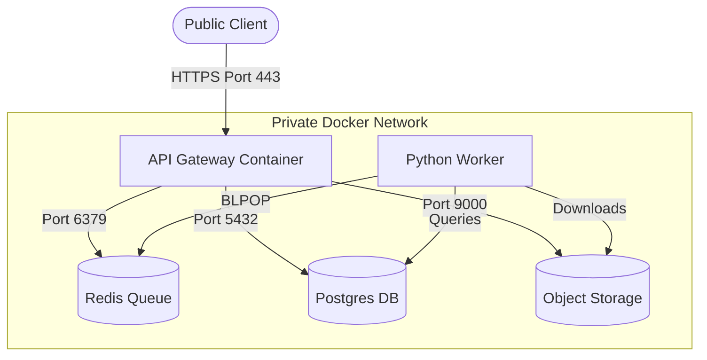

# Security and Data Protection Plan: Enterprise OCR Platform

As an Enterprise OCR Platform processing highly sensitive Personal Identifiable Information (PII) (e.g., passports, national ID cards, driver licenses), implementing robust security and data protection measures is paramount. This document outlines the key security vulnerabilities of the current architecture and provides feasible, industry-standard solutions to address them.

---

## 1. Cryptographic Data Protection

### Encryption in Transit
* **Vulnerability:** Unencrypted communication between services could allow interception of sensitive document data, OCR text, or API tokens.
* **Solutions:**
  * Enforce **TLS 1.3** for all public-facing HTTP endpoints on the API Gateway.
  * Secure internal networks by enabling TLS/SSL for database connections (PostgreSQL `sslmode=require`) and Redis (`rediss://` protocol).
  * Configure MinIO/S3 to refuse non-SSL requests using bucket policies (`aws:SecureTransport: false` deny policy).

### Encryption at Rest
* **Vulnerability:** Compromise of database storage or object storage exposes raw PII and sensitive document images.
* **Solutions:**
  * **Application-Level Field Encryption:** Encrypt highly sensitive database columns (e.g., ID numbers, names, DOB, sex) in GORM before saving to PostgreSQL. Use **AES-GCM-256** with key rotation. Go libraries like `vault` or native cryptographic packages can handle this transparently during serialization.
  * **Storage Encryption:** Enable Server-Side Encryption (SSE-S3 or SSE-KMS) on the MinIO/S3 buckets containing document images and trained model weights.
  * **Database Volume Encryption:** Configure disk-level encryption (e.g., dm-crypt or AWS EBS KMS encryption) on host volumes for the Postgres data directory.

---

## 2. Access Control and Multi-Tenancy

### Robust Token Management
* **Vulnerability:** Long-lived JWT tokens can be stolen and misused; storing tokens in local storage exposes them to Cross-Site Scripting (XSS) attacks.
* **Solutions:**
  * Implement **short-lived access tokens** (e.g., 15 minutes) paired with **refresh tokens** stored in database-backed tables for revocation capability.
  * Deliver JWTs to the client using **HTTP-Only, Secure, SameSite=Strict cookies** to completely prevent JavaScript-based token access.

### Strict Tenancy Isolation
* **Vulnerability:** Human error in writing database queries might leak records from one tenant to another.
* **Solutions:**
  * Use **GORM Global Query Scopes** to automatically append `tenant_id = ?` to all database SELECT, UPDATE, and DELETE operations.
  * Implement **Row-Level Security (RLS)** in PostgreSQL as a secondary defense layer to guarantee database-enforced separation at the connection level.

### Granular Role-Based Access Control (RBAC)
* **Vulnerability:** Unprivileged users could trigger expensive model training jobs or verify their own documents.
* **Solutions:**
  * Enforce strict middleware checks on endpoints based on the `role` claim in the JWT.
  * Map endpoints strictly to required clearance:
    * `/api/documents/upload`, `/api/documents/:id`: Accessible by `user`, `reviewer`, `admin`.
    * `/api/reviews`, `/api/documents/:id/review`: Restrained to `reviewer` and `admin` roles.
    * `/api/training/*`, `/api/models/:id/deploy`: Restrained to the `admin` role.

---

## 3. Secure File Upload Pipeline

### Content Validation
* **Vulnerability:** Attackers might upload malicious files (e.g., shell scripts disguised as images or PDFs) to execute code on the worker nodes.
* **Solutions:**
  * **Magic Byte Detection:** Do not rely on file extensions. Use Go's `http.DetectContentType` to read the first 512 bytes of uploaded files to ensure they are valid image types (`image/png`, `image/jpeg`) or `application/pdf`.
  * **Size Limitation:** Restrict file uploads to a maximum of 10MB via Fiber configuration.

### Virus and Malware Scanning
* **Vulnerability:** Malicious binaries uploaded as documents could exploit parser vulnerabilities in Python PIL, docTR, or pdfium.
* **Solutions:**
  * Integrate an open-source scanning daemon (e.g., **ClamAV**) directly into the API Gateway. Scan files in memory before writing them to object storage.

---

## 4. Compliance and Data Minimization

### Auto-Pruning and Data Retention Policies
* **Vulnerability:** Retaining sensitive documents indefinitely increases liability and compliance risks (GDPR, CCPA).
* **Solutions:**
  * Implement a strict retention scheduler. Once a document's verification status is updated (either `verified` or `failed_verification`), start a countdown timer.
  * Automatically delete the source document image from object storage and redact the database values after a defined period (e.g., 7 days) unless explicitly flagged for continuous learning.

### Labeled Data Sanitization
* **Vulnerability:** Continuous learning datasets store document images containing sensitive details that are not needed for model training (e.g., portraits, signatures).
* **Solutions:**
  * **Redaction Pipeline:** Automatically black out regions containing portrait photos, signatures, or unrelated text blocks before adding a reviewed document image to the training `dataset_images` directory.

---

## 5. Infrastructure and Secret Management

### Private Network Segmentation

* **Vulnerability:** Exposing databases, Redis, or MinIO directly to the internet increases the attack surface.
* **Solutions:**
  * Remove host port mappings for Postgres (5432), Redis (6379), and MinIO (9000) from production deployment configurations.
  * Expose **only** the API Gateway (port 8080 or 443) to the host interface. Allow internal services to communicate purely over a private Docker network.

### Hardened Container Images
* **Vulnerability:** Running containers as root allows attackers who compromise a container to gain root access to the host machine.
* **Solutions:**
  * Use **Distroless** or minimal Alpine base images.
  * Explicitly define non-root system users in Dockerfiles (e.g., `USER nonroot`) and assign file permissions accordingly.

### Production Secret Injection
* **Vulnerability:** Leaving database credentials and JWT secret keys in `.env` files on disk or inside docker-compose files risks exposure via git or unauthorized access.
* **Solutions:**
  * Integrate a secrets manager (e.g., HashiCorp Vault, AWS Secrets Manager, or Google Secret Manager).
  * Inject secrets directly into container environment variables at runtime, ensuring they never reside in static files on host storage.
